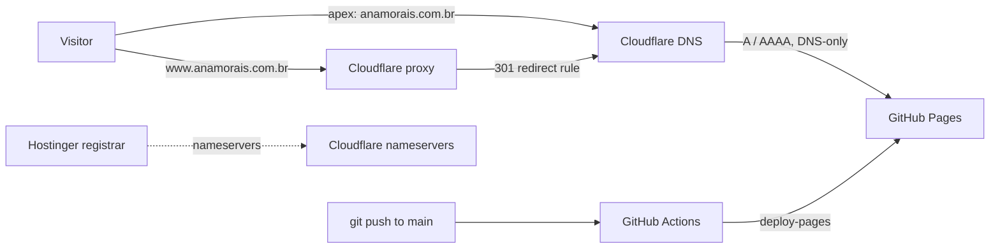

# Deployment & Domain Setup Report

How to publish this site on **GitHub Pages** (via a **GitHub Actions** pipeline), point Ana's
**Hostinger** domain at it through **Cloudflare**, and set up the **www → apex redirect**.

Everything static is already built — this document only covers hosting, DNS and CI/CD.

---

## 0. The values used in this setup

These are already filled into every file and command below — nothing left to replace.

| What | Value |
|---|---|
| Domain (registered at Hostinger) | `anamorais.com.br` |
| GitHub username / repo | `anamoraisedu` / `anamoraisedu.github.io` |

> ⚠️ This is **not** the GitHub account logged in on the build machine. The repo must be created
> under **Ana's own GitHub account** (`anamoraisedu`).

**Canonical URL chosen:** the **apex** (`https://anamorais.com.br`) is the real address;
`www.anamorais.com.br` **redirects** to it. (Easy to flip later — see §5.)

---

## 1. How the pieces fit together



- **Hostinger** = where the domain is *registered*. Its only job here is to hand DNS control to
  Cloudflare (by changing the nameservers).
- **Cloudflare** = DNS + the www→apex redirect + HTTPS at the edge.
- **GitHub Pages** = serves the files.
- **GitHub Actions** = rebuilds/redeploys automatically on every push.

**Do the parts in this order** (avoids the classic "HTTPS certificate stuck" problem):
GitHub repo → Cloudflare DNS → Hostinger nameservers → GitHub custom domain/HTTPS → www redirect.

---

## 2. GitHub — repo + Actions deploy

1. On Ana's GitHub account, create a **new empty repository** named **`anamoraisedu.github.io`**
   (public). Naming it after her username makes it a "user site" served at the domain root — ideal
   for an apex custom domain. *(Any repo name also works with a custom domain, but this is cleanest.)*

2. Push this project to it. From the project folder:

   ```bash
   # CNAME is already set to anamorais.com.br in this repo, so just:
   git add .
   git commit -m "Site da Ana Morais + pipeline de deploy"
   git branch -M main
   git remote add origin https://github.com/anamoraisedu/anamoraisedu.github.io.git
   git push -u origin main
   ```

   > The machine is logged into a different GitHub account. Either push over HTTPS and authenticate
   > as **Ana** when prompted (use a Personal Access Token as the password), or have her run these
   > commands on her own machine / GitHub Desktop.

3. In the repo: **Settings → Pages → Build and deployment → Source = "GitHub Actions"**.
   (Do **not** pick "Deploy from a branch" — this repo ships its own workflow.)

4. The workflow `.github/workflows/deploy.yml` runs automatically on every push to `main`
   (or `master`). Watch it under the **Actions** tab; a green run means the site is live at
   `https://anamoraisedu.github.io`. Confirm that first, *before* touching DNS.

---

## 3. Cloudflare — add the domain & DNS records

1. Create a free Cloudflare account → **Add a site** → enter `anamorais.com.br` → **Free** plan.
2. Cloudflare scans existing records. Delete any old `A`/`AAAA`/`CNAME` for `@` and `www` that
   point at Hostinger's parking/hosting — you'll replace them below.
3. Cloudflare shows **two nameservers** (e.g. `xxx.ns.cloudflare.com`, `yyy.ns.cloudflare.com`).
   Keep that tab open — you'll paste them into Hostinger in §4.
4. Under **DNS → Records**, add exactly these:

   **Apex (`@`) → GitHub Pages, DNS-only (grey cloud):**

   | Type | Name | Value | Proxy status |
   |---|---|---|---|
   | A | `@` | `185.199.108.153` | **DNS only** |
   | A | `@` | `185.199.109.153` | **DNS only** |
   | A | `@` | `185.199.110.153` | **DNS only** |
   | A | `@` | `185.199.111.153` | **DNS only** |
   | AAAA | `@` | `2606:50c0:8000::153` | **DNS only** |
   | AAAA | `@` | `2606:50c0:8001::153` | **DNS only** |
   | AAAA | `@` | `2606:50c0:8002::153` | **DNS only** |
   | AAAA | `@` | `2606:50c0:8003::153` | **DNS only** |

   **www → the redirect (proxied, orange cloud):**

   | Type | Name | Value | Proxy status |
   |---|---|---|---|
   | CNAME | `www` | `anamoraisedu.github.io` | **Proxied** |

   > Why the mix? Apex is **DNS-only** so GitHub can issue its own HTTPS certificate directly.
   > `www` is **Proxied** because Cloudflare can only run a **Redirect Rule** (§5) on traffic that
   > passes through its proxy.

---

## 4. Hostinger — hand DNS to Cloudflare

1. Hostinger **hPanel → Domains → `anamorais.com.br` → DNS / Nameservers** (may be labelled
   *Servidores de nomes*).
2. Choose **"Use custom / other nameservers"** and paste the **two Cloudflare nameservers** from §3.3.
3. Save. Propagation is usually 15 min–2 h (can be up to 24 h). Back in Cloudflare the site flips to
   **Active** once it detects the change (it emails you).

The **`CNAME` file in this repo** is already set to the apex domain:

```
anamorais.com.br
```

(GitHub Pages reads this to bind the custom domain — no edit needed.)

---

## 5. GitHub Pages — custom domain, HTTPS, and the www redirect

Do this **after** Cloudflare is Active and the apex resolves to GitHub.

1. **Settings → Pages → Custom domain** → enter `anamorais.com.br` → **Save**.
   GitHub runs a DNS check, then provisions a Let's Encrypt certificate (minutes, occasionally up to
   24 h).
2. When the cert is ready, tick **Enforce HTTPS** (greyed out until the cert exists — that's normal).
3. **Cloudflare SSL/TLS:**
   - **SSL/TLS → Overview → Full**. **Never use "Flexible"** — with GitHub Pages (which forces
     HTTPS) Flexible causes an infinite redirect loop.
   - **SSL/TLS → Edge Certificates → Always Use HTTPS = On.**
4. **The www → apex redirect** — **Cloudflare → Rules → Redirect Rules → Create rule:**
   - **Name:** `www to apex`
   - **When incoming requests match** → *Custom filter expression*:
     `(http.host eq "www.anamorais.com.br")`
   - **Then… → URL redirect → Dynamic**, expression:
     `concat("https://anamorais.com.br", http.request.uri.path)`
   - **Status code:** `301` · **Preserve query string:** ✅ · **Deploy**.

   Now `www.anamorais.com.br/qualquer-coisa` 301s to `https://anamorais.com.br/qualquer-coisa`.

> **Want the opposite (www as the main address)?** Point the CNAME file + GitHub custom domain at
> `www.anamorais.com.br`, make **`www` DNS-only** and **`@` proxied**, and swap the redirect rule to
> match the apex and redirect to `https://www.anamorais.com.br`.

---

## 6. Verification checklist

- [ ] Actions run is green; `https://anamoraisedu.github.io` shows the site.
- [ ] `dig anamorais.com.br +short` returns the four `185.199.10x.153` IPs.
- [ ] GitHub Pages shows **"DNS check successful"** and HTTPS is enforced.
- [ ] `https://anamorais.com.br` loads with a valid padlock.
- [ ] `http://anamorais.com.br` → upgrades to HTTPS.
- [ ] `https://www.anamorais.com.br` → 301 redirects to the apex.
- [ ] Editing `index.html` and pushing re-deploys automatically within ~1 min.

---

## 7. Troubleshooting

| Symptom | Cause / Fix |
|---|---|
| **Redirect loop / `ERR_TOO_MANY_REDIRECTS`** | Cloudflare SSL mode is **Flexible**. Switch to **Full**. |
| **GitHub: "certificate provisioning" stuck / HTTPS greyed forever** | Apex is **Proxied** (orange) so GitHub can't validate. Set the apex records to **DNS only**. Then in Pages, remove and re-add the custom domain. |
| **404 on the custom domain** | The `CNAME` file is missing/wrong in the deployed artifact, or the domain isn't set in Settings → Pages. Ensure `CNAME` = apex domain and was included in the last deploy. |
| **www doesn't redirect** | The `www` record must be **Proxied** (orange) for the Redirect Rule to fire; check the rule's host matches `www.anamorais.com.br` exactly. |
| **Old Hostinger page still showing** | DNS still cached / nameservers not switched yet. Wait for propagation; verify with `dig NS anamorais.com.br +short` returning Cloudflare's nameservers. |
| **Changes don't appear after push** | Check the **Actions** tab for a failed run; confirm Pages Source = **GitHub Actions**. |

---

## 8. Files added to the repo for this

| File | Purpose |
|---|---|
| `.github/workflows/deploy.yml` | GitHub Actions pipeline — deploys to Pages on every push. |
| `CNAME` | Tells GitHub Pages the custom domain — set to `anamorais.com.br`. |
| `.nojekyll` | Skips Jekyll processing (already present). |
| `SETUP.md` | This report. |

---

### One-line summary for Ana
> Registrar = Hostinger (just points nameservers to Cloudflare). Cloudflare = DNS + www→apex
> redirect + HTTPS. GitHub = hosts the files, Actions redeploys on every `git push`.
